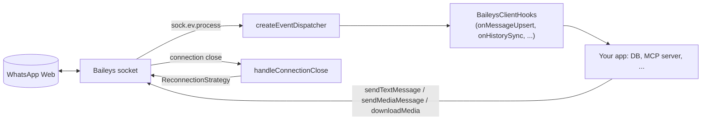

# @amiticia/baileys-client

[](https://github.com/eusoubrasileiro/baileys-client/actions/workflows/ci.yml)

A small, storage-free WhatsApp client library wrapping
[@whiskeysockets/baileys](https://github.com/WhiskeySockets/Baileys) `7.0.0-rc14`. It
handles connection, reconnection, history sync, message sending, media download and
JID/LID utilities, and forwards every Baileys event to hooks you supply — what to persist
is entirely up to the consumer.

Consumed by [whatsapp-mcp](https://github.com/eusoubrasileiro/whatsapp-mcp).



## Install

The package is installed straight from GitHub. `dist/` is not committed — a `prepack`
script builds it during a git install, and pnpm 10 only runs a git dependency's build
script when the consuming project allows it. Add the allowlist first:

```jsonc
// your package.json
"pnpm": {
  "onlyBuiltDependencies": ["@amiticia/baileys-client"]
}
```

```bash
pnpm add github:eusoubrasileiro/baileys-client
```

To develop against a local checkout instead (how
[whatsapp-mcp](https://github.com/eusoubrasileiro/whatsapp-mcp) consumes it), clone the
two repos side by side, depend on `"@amiticia/baileys-client": "link:../baileys-client"`,
and run `pnpm install && pnpm build` in this repo.

## Usage

```typescript
import { startConnection, sendTextMessage, phoneToJid } from "@amiticia/baileys-client";
import pino from "pino";

const logger = pino({ level: "info" });

const { socket, connectionState, socketState } = await startConnection({
  authDir: "./auth_info",
  logger,
  hooks: {
    onQrCode: (qr, ascii) => console.log(ascii),
    onConnected: (user) => console.log(`Connected as ${user.name}`),
    onMessageUpsert: (messages, type) => {
      for (const msg of messages) {
        // store in your DB, process, etc.
      }
    },
  },
});

// Send a message
const jid = phoneToJid("5511900000000");
const result = await sendTextMessage(socket, jid, "Hello!", logger);
```

## API

### Connection

- `startConnection(config)` — creates the socket, wires Baileys events to hooks, handles auto-reconnect. Returns `{ socket, connectionState, socketState }` (no singletons — one set per call).
  - `config`: `authDir`, `logger` (pino), `hooks?`, `shouldIgnoreJid?`, `syncFullHistory?`, `shouldSyncHistoryMessage?` (defaults to accepting every sync type, including `FULL`), `historySyncInactivityTimeoutMs?` (default 60000), `generateHighQualityLinkPreview?`.
  - Hooks: `onQrCode`, `onConnecting`, `onConnected`, `onDisconnected`, `onReady`, `onMessageUpsert`, `onMessagesUpdate`, `onContactsUpsert`, `onContactsUpdate`, `onChatsUpdate`, `onHistorySync`, `onGroupsSync`, `onLidMapping`.
- `handleConnectionClose(...)`, `defaultReconnectionStrategy()`, `DEFAULT_ATTEMPT_TIMEOUT_MS` — the reconnect decision (retry / logout / give up) and its pluggable policy (`ReconnectionStrategy`).
- `createEventDispatcher(deps)` — the Baileys-event → hook dispatcher, exported for testing and custom wiring.

### Sending

- `sendTextMessage(socket, jid, text, logger)` — returns `{ success, messageId?, error?, errorKind? }`; never throws. `errorKind` is `transient` / `permanent` / `unknown` (see `classifySenderError`)
- `sendMediaMessage(socket, jid, { buffer, type, caption?, fileName?, mimetype? }, logger)` — same return shape
- `classifySenderError(err)` — maps a thrown error to a `SenderErrorKind`

### Media

- `downloadMedia(socket, params, logger, adapter?)` — downloads and decrypts media from its stored key/path; on an expired CDN URL, the `MediaRefreshAdapter` (default: `defaultMediaRefreshAdapter()`) re-requests it once and retries

### Utilities

- `phoneToJid(phone)` — `"5511900000000"` to `"5511900000000@s.whatsapp.net"`
- `normalizeJid(jid)` — strips device suffix
- `isGroupJid(jid)` / `isLidJid(jid)` — checks `@g.us` / `@lid`
- `makeLidResolver(socket)` — `getPNForLID(lid)` / `getLIDForPN(pn)` over Baileys' LID mapping store
- `parseMessage(msg)` — extracts text/media content into a flat `ParsedMessage`
- `extractMessageContent(content)` — preview string for any Baileys message envelope
- `extractMediaInfo(message)` — pulls media metadata from a WAMessage
- `mimetypeToExtension` — mimetype → file-extension map
- `generateAsciiQR(data)` — renders QR as ASCII string

### Types

`BaileysClientConfig`, `BaileysClientHooks`, `ConnectionState`, `ConnectionStatus`, `SocketState`, `WhatsAppSocket`, `SendResult`, `SenderErrorKind`, `ParsedMessage`, `MessageContent`, `MessageContentExtractor`, `MediaInfo`, `MediaType`, `DownloadMediaParams`, `MediaRefreshAdapter`, `MediaRefreshContext`, `ReconnectionStrategy`, `ConnectionCloseDeps`, `EventDispatcherDeps`, `LidResolver`, plus re-exported Baileys types (`WAMessage`, `WAMessageUpdate`, `Contact`, `Chat`).

## Development

```bash
pnpm install
pnpm build     # tsup -> dist/
pnpm test      # vitest
pnpm typecheck # tsc --noEmit
pnpm check     # biome lint + format
pnpm format    # biome auto-fix
```

Husky hooks enforce the gate: `pre-commit` runs check, typecheck and both test suites;
`commit-msg` runs commitlint (Conventional Commits). The unit tests drive the reconnect
state machine against fakes and never touch WhatsApp's network.

## License

MIT — see [`LICENSE`](./LICENSE). Not affiliated with WhatsApp or Meta; Baileys is an unofficial
WhatsApp Web client, so use it within WhatsApp's terms and at your own risk.
